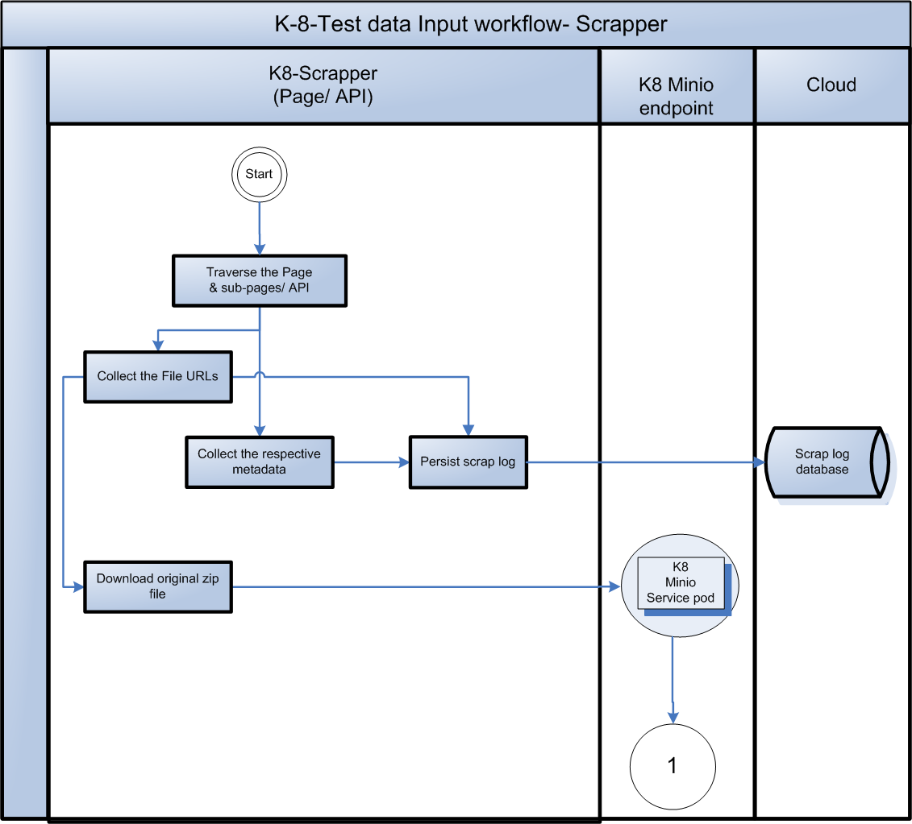
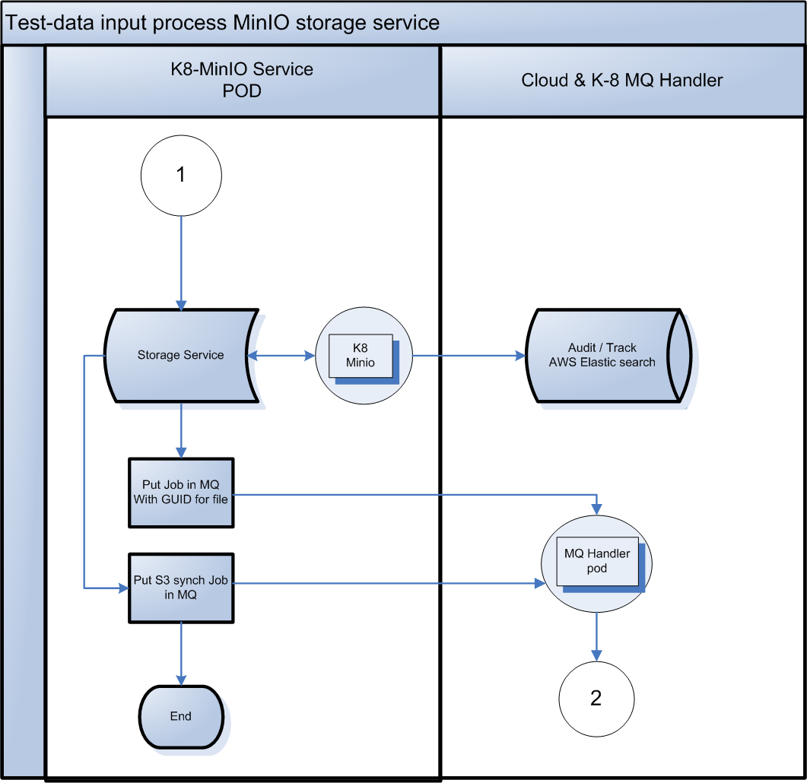
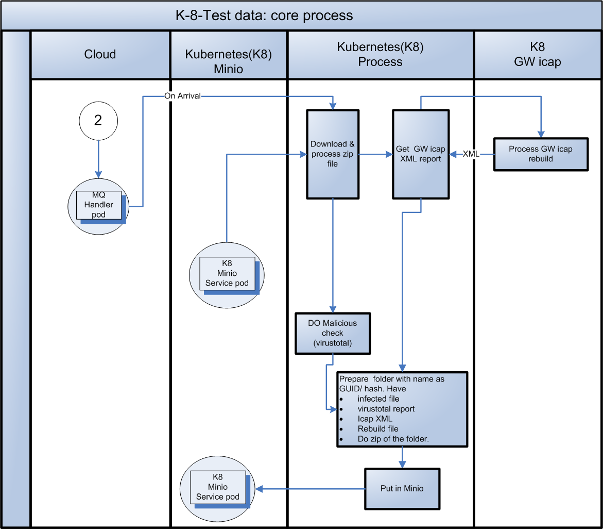

# k8-test-data

If you are working on this project via Upwork, see also our [Upwork Rules of Engagement](https://github.com/filetrust/Open-Source/blob/master/upwork/rules-of-engagement.md)

### Project brief

**Objective**: Test data for GW Rebuild engine running in the multiple K8 Projects

- In order to effectively test the K8 projects, we need a sufficient test data file, that is able to simulate different type of threats and covering all file types supported by Glasswall. Key activities to be covered are 
  - GitHub repo with thousands of test files to be created. 
  - Proceed with caution when handling live malware files.
  - The file types should cover all supported file types by Glasswall (Refer https://glasswallsolutions.com/technology/ or https://file-drop.co.uk/ )
  - Sample files can be sourced from Glasswall public files(https://engineering.glasswallsolutions.com/docs/products/cloud-sdk/sample-files/ , https://github.com/filetrust/GW-Test-Files , )
  - Glasswall private files (https://github.com/filetrust/malicious-test-files  , https://github.com/filetrust/sdk-eval-toolset/tree/master/test  and  https://console.aws.amazon.com/s3/buckets/jp-testbucket-1/?region=eu-west-2) 
  - Dynamic generation of files , based on programmatically modifications of content, structure and capabilities.

- The final objective is to be able to to support - 4 Million files with an average file size of 10 Mbs. However at start we will start with Github repo. 

**Process Flow & Architecture**
  For each type of work, kubernetes (K8)  PODs of that type will be created. The orchestration of "POD type" clusters through Event driven architecture will complete  the process flow. 
  - **K8 - Scrapper Pod **
  
     
     - The original zip file will be downloaded by scrapper along with metadata.
     - Persist the scrap log in cloud.
     - Base scrapper should have batch scrapping functionality.
     - Push the downloaded zip file to MinIO  service with GUID as filename of the zip file.
     
   - **K8 MinIO Storage Pod **
   
   
     - The original zip file gets downloaded and metadata collected like URL, date created etc.
     - Communicates with MinIO docker and stores the file.
     - Put the Job in Rabbit MQ via MQ handler POD with GUID as filename for file processing by K8-core POD..
     - Put the S3 synchronization job in MQ. 
     
  - **K8 core POD**
  
  
     - On arrival in MQ, download the original zip file from Minio. Unzip it.
     - Create a folder, with name as **GUID or hash**.
     - Do malicious check from virustotal. (will be handled through K8 POD type 2.1 )
     - Send the file to Glasswall Icap rebuild service. (should be in  K8 POD )
     - Download the virustotal report.
     - Download GW icap xml report and rebuild file
     - Make a zip of the folder with same name as folder name.
     - Put the Job in Rabbit MQ with GUID as filename.
     
  -**MinIO - S3 Synchronization POD**
  
  
     - Non K-8 activities or create another K8 POD. This will long running as the queue will built up.
     
  - **K8 File Distribution POD**
     - This Kubernetics POD will host distribution API, which will cater to all the client requests to provide the file from Minio service. 
  
Malware Public Repositories ( Proceed with caution when handling live malware) :

**VirusShare**: https://virusshare.com/

  - Requires login (free)
  - ZIP password is “infected"

**The Zoo**: https://github.com/ytisf/theZoo

  - Look in malwares/Binaries subdirectory
  - ZIP password is “infected"

**Malshare**: https://malshare.com

  - Immediate access - register to get an API key allowing download of 1000 samples/day

**Das Malwerk**: http://dasmalwerk.eu/

  - Immediate access
  - ZIP password is “infected”

Public malware reference - https://cyberlab.pacific.edu/resources/malware-samples-for-students
Note :  http://contagiodump.blogspot.com/ in above public reference not implemented since it is paid service and password for malware zip is not availble

### Build

* Set .env file in each service

`docker build -t rabbitmq-receiver rabbitmq_receiver`

`docker build -t glasswallcrawler:1.0 gw_crawler`

`docker build -t k8-file-processor file_processor`

`docker build -t k8-file-distribution file_distribution`

`docker build -t glasswall-rebuild  glasswall_rebuild`

### Run

`docker-compose up`

### Run security check

`python3 -m bandit --skip B605 -ll -r .`
